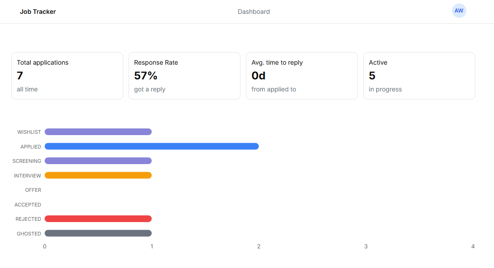
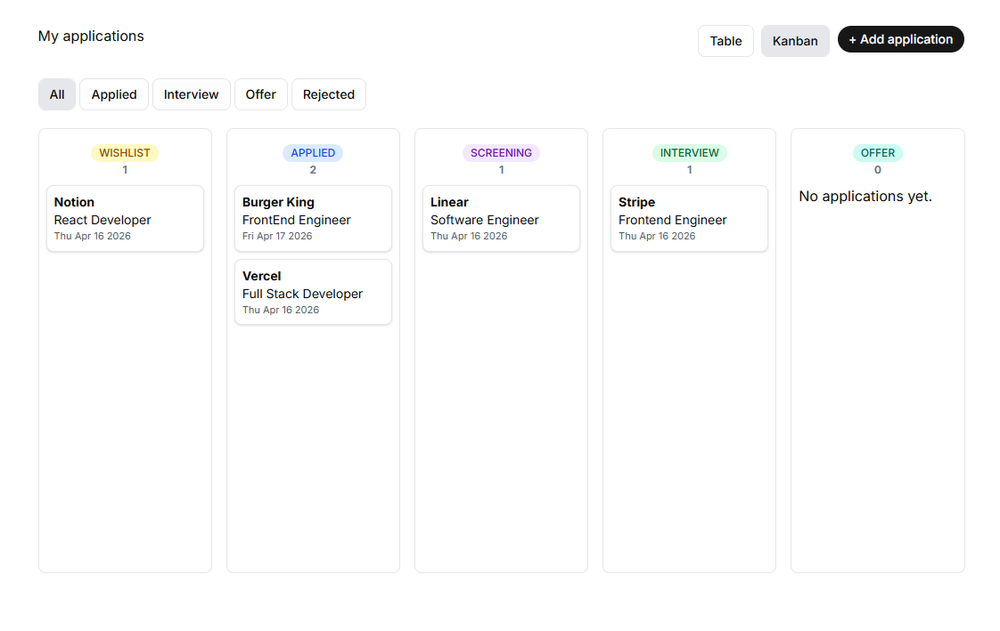

# JobTracker

> A full-stack job application tracker built with Next.js 15, featuring a kanban board, application analytics, and Google OAuth. The App is designed to help individuals stay on top of their job search.




## Live Demo

[job-tracker-umber-six.vercel.app](https://job-tracker-umber-six.vercel.app)

> Try the app without signing in — click **Try Demo** on the landing page.

## Features

- Google OAuth authentication via NextAuth v5
- Add, edit, and delete job applications
- Kanban board with drag and drop (dnd-kit) and optimistic UI
- Application status tracking with full status history
- Stats dashboard — response rate, average reply time, active applications
- Follow-up reminder flag for applications with no response in 14+ days
- Contact management per application
- Notes per application
- Mobile responsive

## Tech Stack

- **Framework** — Next.js 15 (App Router)
- **Language** — TypeScript
- **Database** — PostgreSQL (Neon)
- **ORM** — Prisma v7
- **Auth** — NextAuth v5 (Google OAuth, database sessions)
- **UI** — shadcn/ui, Tailwind CSS v4
- **Charts** — Recharts
- **Drag & Drop** — @dnd-kit/core
- **Validation** — Zod v4, React Hook Form
- **Testing** — Vitest
- **Deployment** — Vercel

## Getting Started

### Prerequisites

- Node.js 18+
- PostgreSQL database (Neon recommended)
- Google OAuth credentials

### Installation

1. Clone the repo

```bash
   git clone https://github.com/anthonyjwwong/job-tracker.git
   cd job-tracker
```

2. Install dependencies

```bash
   npm install
```

3. Set up environment variables

```bash
   cp .env.example .env
```

4. Run database migrations

```bash
   npx prisma migrate dev
```

5. Seed the database

```bash
   npx prisma db seed
```

6. Start the dev server

```bash
   npm run dev
```

## Environment Variables

```env
DATABASE_URL=
AUTH_SECRET=
AUTH_GOOGLE_ID=
AUTH_GOOGLE_SECRET=
```

## Author

Built by [Anthony Wong](https://github.com/anthonyjwwong)
